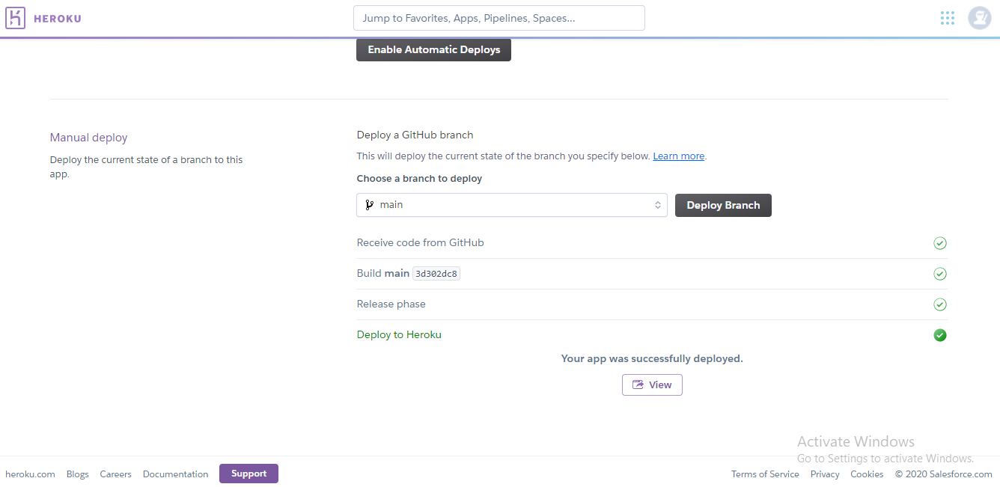
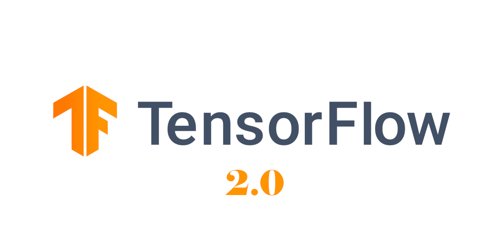
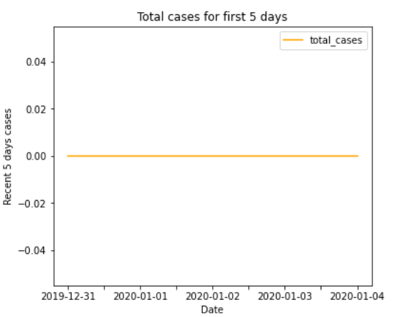
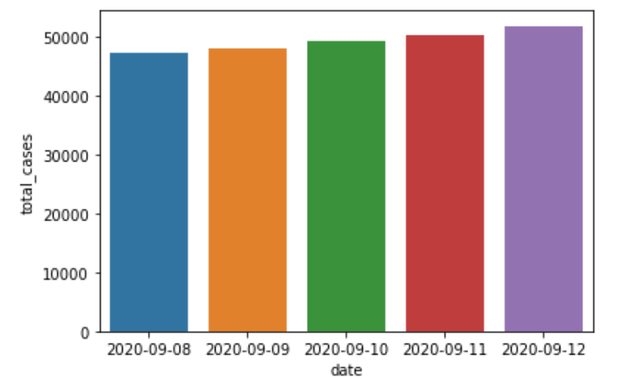
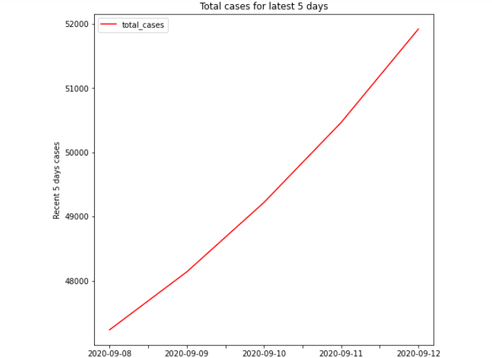
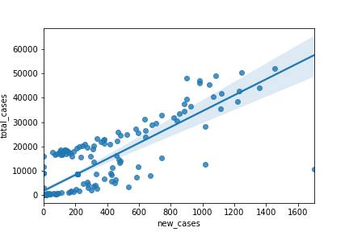
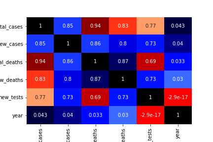
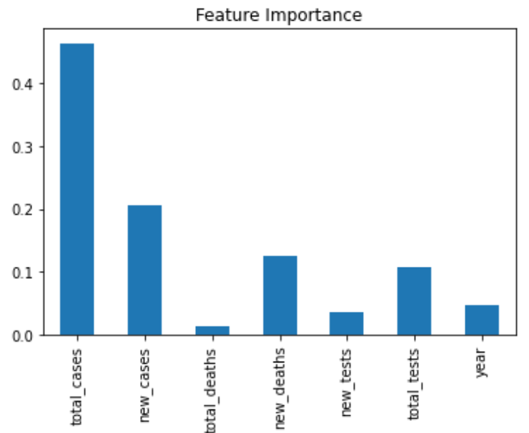
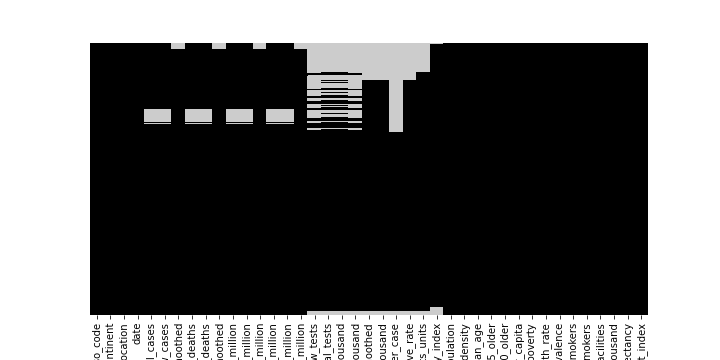
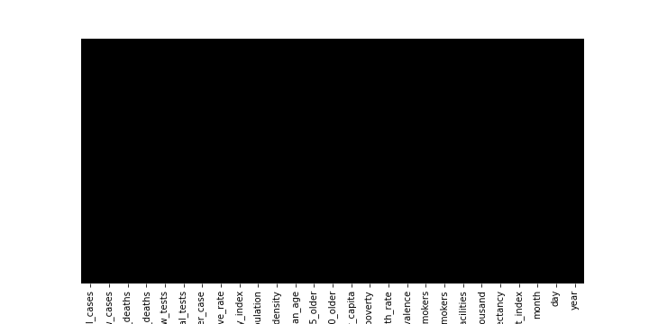

# Nepal Corona Case Predictor
* Overview 
* Motivation
* Technical aspect
* Installation
* Deployment on Heruko
* Updation 
* Technologies used
* Credits

# Overview
This is a Machine Learning Model built using the dataset of COVID-19 to predict the new cases of Nepal. The model is cleaned and polished to reach certain level of accuracy inorder to predict new cases. Since, the data was continous dataset with single output I have used Regression model for this model.

# Motivation
I was motivated to involve in this project as a project for my final year college project and what could be the best to utilize the things that I have been learning since the start of COVID-19 pandemic, I always wanted to make an app which could predict something by itself for the future, but the main question for me was what shall I use for dataset. Fortunately, as I was doing another project on mobile app using flutter sdk which is also included in my github repo https://github.com/sththapa/Corona-Tracking-App, and video link https://www.youtube.com/watch?v=UQzt_VKOcCY&t=793s, this app was about the COVID-19 which could show us the updated COVID-19 case of Nepal everytime we open an app. Now, this thing trigerred my mind that I thought why not to do the same thing to make a predictive model using Machine Learning. I tried to search a lot of data on the internet and I finally found a dataset of all the lastest cases of world. But, my intension was to predict the new cases of Nepal only so I had filtered the country and choosed Nepal only. On this 1 month journey of project I am happy that I got to learn many new things and also added that things that I knew. These things always motivated me towards this project.

# Technical aspect
The project is in three parts:
>1. At first model was built using Jupyter notebook where I trained machine learning model
>2. Model is trainded and tested with Deep Learning Model as well.
>3. Streamlit framework was used for building the frontend framework where user can interact easily.
>4. App has been deployed in heroku to make it live.

# Installation
The code is completely written in python 3 language and for frontend I installed streamlit using the command:
> pip install streamlit

# Deployment On Heroku

# Updation
Certain figures and minor changes will be updated time to time if required.

# Technologies used

# Credits
My credit goes to all the google datasets, my udemy teachers who taught me how to use Machine Learning model, Deep Learning and also various blogs related to Machine Learning and Data Science.

# Nepal_New_Cases_Predictor_Project Overview
* Created a model that can estimate the new COVID-19 cases of Nepal.
* Cleaned and filtered the data where I selected Nepal as a country but if we want we can select any country and proceed its case study.
* Used RandomForest Regressor model to train and built the model, also compared the accuaracy of RandomForest Regressor, KNN,Linear Regression,Ridge.
* Reached around 87% of accuracy for our predition.
* Trained and tested with Deep Learning Model
* Model is brought into production using Streamlit framework.https://www.streamlit.io/

# Code and Resources Used
Python version : 3.8.3
Packages: pandas, numpy, matplotlib, seaborn, scikitlearn, pickle, streamlit
For Web Framework Requirements : pip install sreamlit
# Problem Definition
The problem we are working on is regression problem where main objective is to predicting the accuracy level for new cases. In short, we can write as:

> Given a dataset of COVID-19, how well our model will predict the new cases?
# Tools
  * Numpy - for numerical operations
  * Pandas - for data analysis
  * Matplotlib - for data visualization
  * Seaborn - same use as Matplotlib with additional features
  * Scikit-Learn(Sklearn) - for machine learning modelling
  * Tensorflow and Keras - for deep learning model
  
# EDA
> Nepal First Five days case which we can see there was no any cases till first five days

> Nepal latest five days bar-chart

> Nepal corona case yearwise comparision (2019 and 2020)

> Nepal latest case line graph

> Newcases vs total cases line graph 

> Seaborn heatmap correlation

> Feature importance after imputation

> Initially before cleaning the data heatmap

> After cleaning the heatmap

# Model Building
First, I cleaned up all the data and converted all the datatypes into numerical format as machine learning model can understand numerical values only.
I also split the data in the ratio of 8:2 i.e. 80% of the data was used for train set and 20% data was used for test set.
I basically used Random Forest Regressor though I compared it with other model and it gave me the higher accuracy so I choosed RandomForest Regressor which is one of the versatile machine learning model.It helped me to achive good accuracy.

# Productionization
I used spyder IDE using streamlit framework to build frontend website to enter the data and see the predicted new case of Nepal new COVID-19 cases.

# Liscence
©️ Santosh Thapa 2020

# Creator
-SANTOSH THAPA

# Demo
Link: https://corona-predictor-nepal-updated.herokuapp.com/

